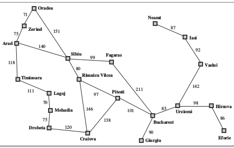

# Graph Search Algorithm
This is an assignment of the class Introduction to AI.(CS major in HNU).

We were required to implement 6 search algorithm: bfs, dfs, ucs, iddfs(iterative-deepening depth-first search), gs(greedy search), astar(A*). Then test all of them to find the answer of Romania holiday problem.

# Usage
Just type make on the terminal. Then type ./romania to see the result.

# The Simplified Romania Map

